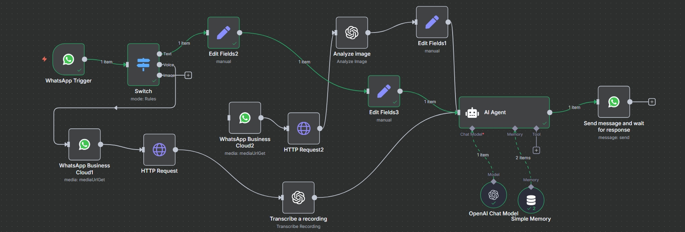

# NexFlow - AI Automation Workflows 🚀

NexFlow is an open-source AI automation platform built using n8n.  
It helps developers and businesses create powerful automation workflows using AI.

---

## ✨ Features

- 🤖 AI-powered automation workflows  
- 🔗 API integrations (OpenAI, WhatsApp, etc.)  
- ⚡ Ready-to-use workflow templates  
- 📊 Scalable and customizable system  
- 🔔 Real-time alerts and automation  

---

## 🧠 Use Cases

- AI WhatsApp Assistant  
- Crypto Trading Alerts Bot  
- Business Process Automation  
- Social Media Automation  
- Data Processing Pipelines  

---

## 🛠️ Tech Stack

- n8n  
- Node.js  
- OpenAI API  
- REST APIs  

---

## 📸 Demo / Screenshots

---

## ⚙️ Installation

1. Install n8n:
npm install -g n8n

2. Run n8n:
n8n

3. Import workflows from this repository

---

## 📜 License

MIT License
